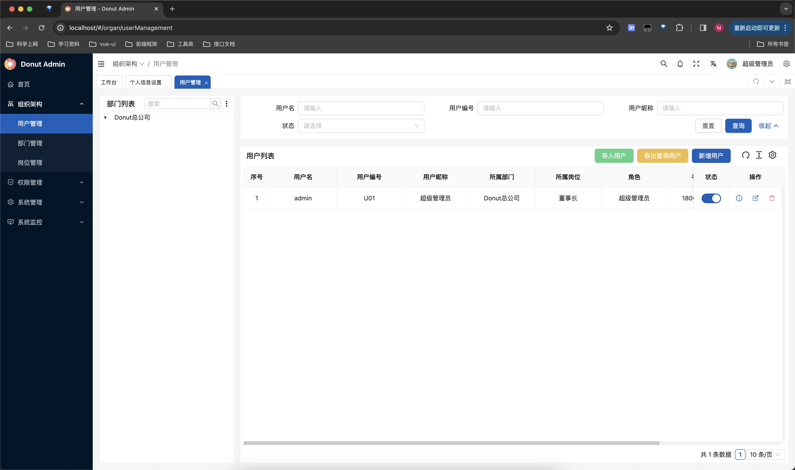
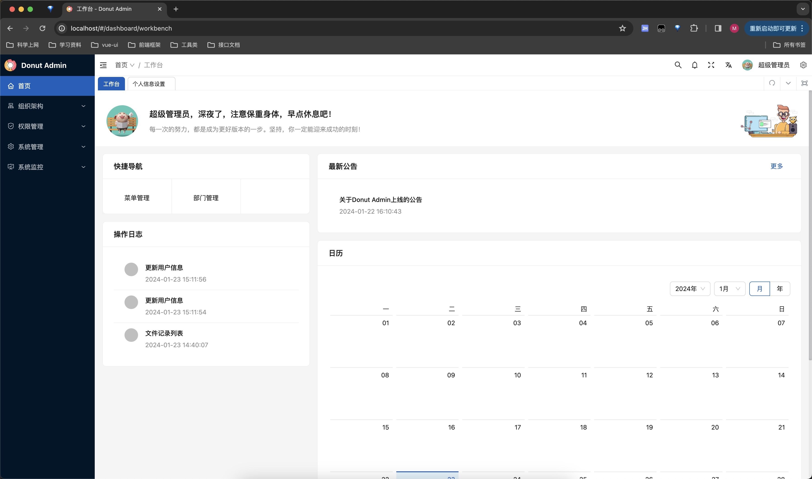
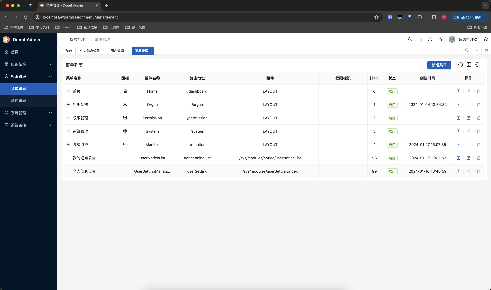

<h2 align="center" style="text-align:center;">
    
     
    Donut Admin (甜甜圈后台通用模板)
</h2>

	<strong>基于Spring Boot3、JDK17的一套多租户（Saas）开源管理系统</strong>

    
    

在线文档地址：[https://donut-doc.lenmotion.cn](https://donut-doc.lenmotion.cn/)

## 功能：
* 租户管理：租户管理，支持多租户，前端可配置不同租户，用户、部门、岗位、角色等数据隔离
* 用户管理：基础的用户管理、用户登录等功能
* 部门管理：提供基于mybatis-plus的数据权限过滤
* 岗位管理：用户关联岗位、岗位与部门关联
* 角色管理：用户关联角色，赋予权限角色菜单权限
* 菜单管理：结合前端的router配置，实现动态路由
* 数据字典：存放字典信息，并且结合easy-trans使用作为数据字典转换
* 操作日志：对于新增、修改与删除等操作存储操作日志
* 登录日志：登录日志存放
* 定时任务：基于Hutool的Cron表达式，支持动态修改
* 通知公告：基于websocket长链接，实现消息推送，并且使用redis，实现分布式情况下，websocket连接的统一管理
* 服务监控：查看服务器相关信息
* 文件管理：使用X-File-Storage实现文件上传与下载，并实现文件与数据库的关联，结合easy-trans自动生成加密的访问链接。可以支持多个存储平台，详细支持列表可以查询[X-File-Storage](https://x-file-storage.xuyanwu.cn/#/)
* 系统设置：配置信息信息、验证码开关、默认密码与默认菜单等相关信息
* 代码生成：可以动态生成代码，前后端代码一键生成，可以配置数据源信息
* 在线用户：监控在线用户，实现强制下线
* 导出中心：导出功能走异步操作，避免长时间等待，导出后通过导出中心下载文件

当然，还有许多的功能正在开发中！敬请期待！

## 技术栈：
#### 后端：
* Spring Boot 3
* JDK 17
* Mysql 8
* Redis
* [Sa-Token](https://sa-token.cc/doc.html#/)
* [MyBatis-Plus](https://baomidou.com/)
* [Easy-Trans](http://easy-trans.fhs-opensource.top/)
* [Hutool](https://hutool.cn/docs/)
* [Knife4j](https://doc.xiaominfo.com/)
* [EasyExcel](https://easyexcel.opensource.alibaba.com/)
* [X-File-Storage](https://x-file-storage.xuyanwu.cn/#/)
* [MapStruct](https://mapstruct.org/)

#### 前端：
前端基于开源项目[Vben](http://vben.vvbin.cn)
* Vue3
* Vite
* [Ant-Design4](https://www.antdv.com/docs/vue/getting-started)

### 项目预览：

https://donut.lenmotion.cn/

账号：admin

密码：123qwe

### 项目启动：
如果您熟悉docker可能部署较为简单，可以直接使用docker-compose启动项目（mysql、redis）服务

您可以在项目根目录下执行 ``docker-compose up -d mysql redis minio init-bucket``

mysql会自动创建数据库并执行初始化sql

当然您可以自己使用您已经启动好的数据库和redis，修改对应application-dev.yml的配置即可

如果您不使用minio或者使用其他的文件存储服务，请修改application.yml中的配置即可
#### 后端：
* 启动类：``donut-api/src/main/DonutApiApplication.java``

#### 前端：
``cd donut-admin-web/``

您需要使用node 16.x，并且建议您使用pnpm

``pnpm install``

``pnpm dev``

默认账户密码：``admin/123qwe``

### 项目部署：

进入项目根目录

``mvn clean package -DskipTests`` 打包api的jar包，也可以修改Dockerfile自动打包

``docker-compose build`` 构建web、api的命令

``docker-compose up -d`` 启动项目

### 演示画面

    
    
    

